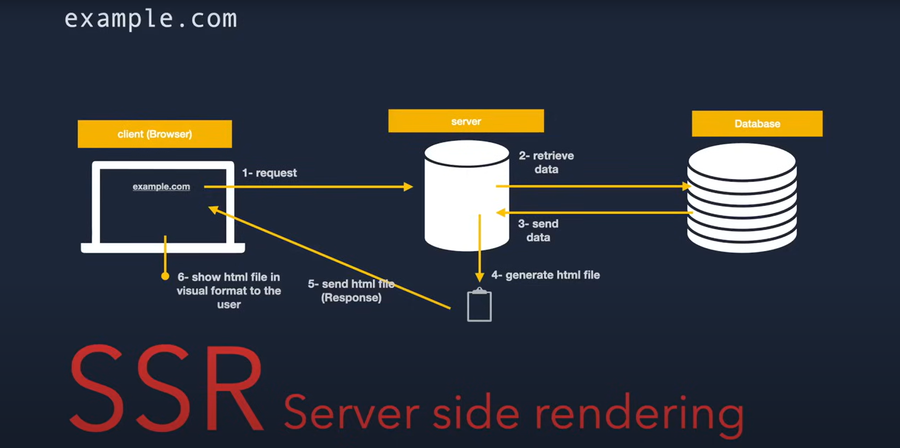
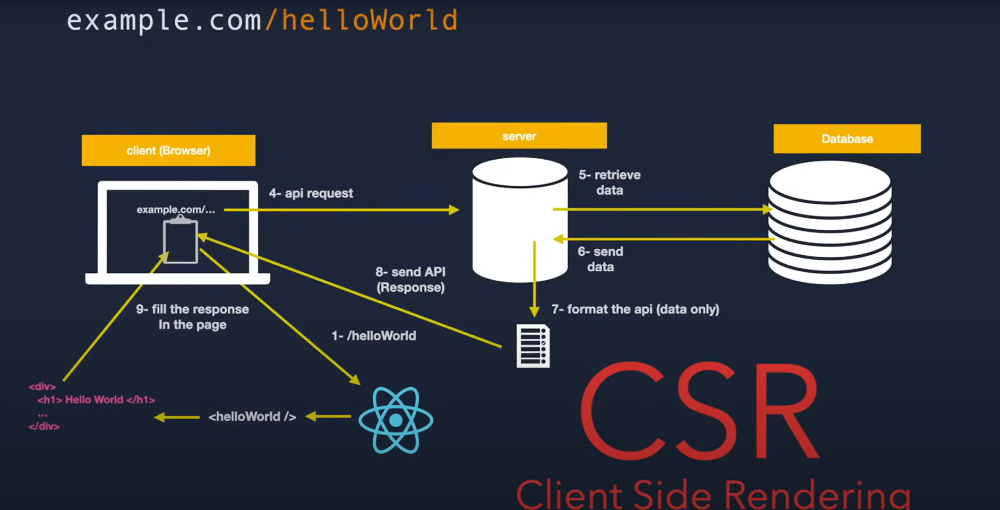

# LearnNextJs

Basic NextJs

## `Server Side Rendering (SSR)` `(SSG)` `(ISG) ` `Search Engine Optimization (SEO)`




---

# Code Sheets

# if want tittle page

```js
export const metadata = {
  title: "write teh ttile",
};
```

# if you want write anything in the path and you want show the same result you can do it when you make folder name [anythinhere]

- # when you write any thing in the path it will print it

```js
export default function ShowArticlePage(props) {
  console.log(props);
  return (
    <div>
      <h1>Article page</h1>
      <h1>{props.params.tittle}</h1>
    </div>
  );
}
```

# to start or build new Page (defult react compounts)

```js
export default function PostsPage() {
  return (
    <div>
      <h1>Posts page</h1>
    </div>
  );
}
```

# transfer to any Pages (Link)

```js
import Link "next/Link"
<Link href="/">Take me to homme Home<Link>
```
